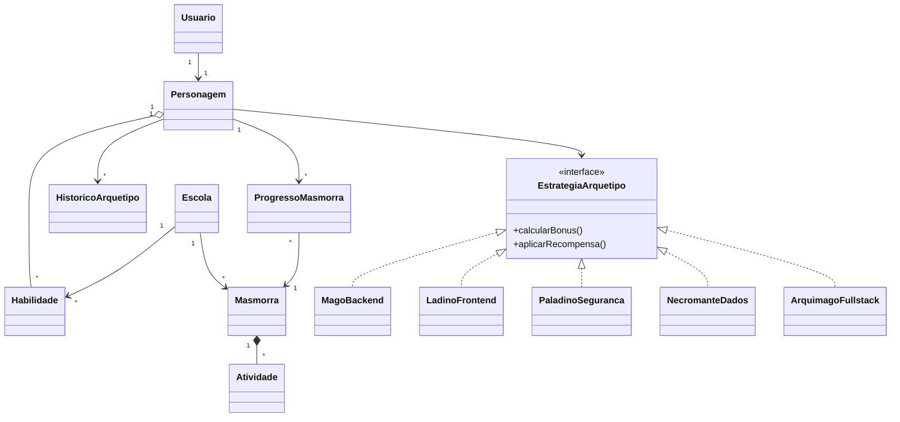

# Modelo de dominio

## Entidades principais

- **Usuario:** representa a conta do estudante.
- **Personagem:** concentra nivel, energia, experiencia, habilidades e arquetipo atual.
- **Escola:** representa uma trilha de conhecimento.
- **Masmorra:** agrupa atividades, dificuldade, requisitos e recompensas.
- **Atividade:** representa uma leitura, quiz, exercicio textual ou desafio pratico.
- **Habilidade:** representa uma competencia desbloqueavel.
- **ProgressoMasmorra:** registra status, tentativas e conclusao.
- **HistoricoArquetipo:** registra as mudancas de classe do personagem.

## Diagrama conceitual inicial

## Padroes previstos

- **Strategy:** encapsula os bonus de cada arquetipo.
- **State:** controla os estados de energia do personagem e as atividades permitidas.
- **Factory:** seleciona a estrategia de arquetipo a partir da experiencia por escola.

O modelo sera refinado antes da implementacao para definir atributos, operacoes, cardinalidades e persistencia.
