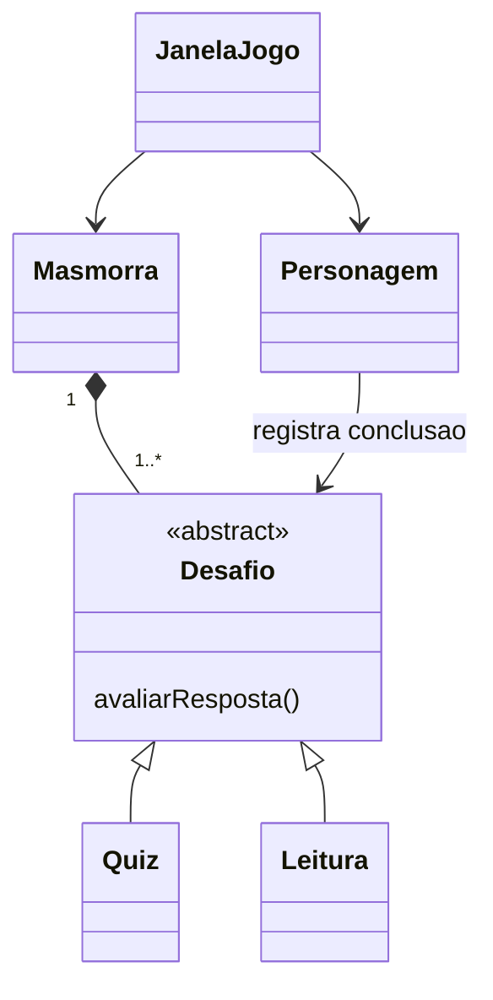

# Modelo de dominio

Modelo inicial para um programa pequeno, sem banco ou servidor. As classes abaixo sao planejadas, nao implementadas.

## Classes principais

- **Personagem:** nome, avatar, nivel, energia, XP geral e por trilha, arquetipo e desafios concluidos. Controla recompensas e descanso.
- **Masmorra:** nome, dificuldade, requisitos e colecao de desafios.
- **Desafio:** classe abstrata com titulo, trilha, recompensa, custo de energia e operacao de avaliacao.
- **Quiz:** desafio com pergunta, alternativas e resposta correta.
- **Leitura:** desafio simples com texto e confirmacao de conclusao.
- **JanelaJogo:** tela Swing que mostra o estado e encaminha acoes ao dominio.

Trilha e arquetipo podem ser enums. Nao e necessario criar uma subclasse de Personagem para cada classe de RPG: mudar o arquetipo nao deve recriar o personagem.

## Diagrama inicial

```mermaid
classDiagram
    JanelaJogo --> Personagem
    JanelaJogo --> Masmorra
    Masmorra "1" *-- "1..*" Desafio
    Personagem --> Desafio : registra conclusao
    class Desafio {
        <<abstract>>
        avaliarResposta()
    }
    Desafio <|-- Quiz
    Desafio <|-- Leitura
```

## Separacao de responsabilidades

A interface Swing nao calcula XP, concede recompensas nem decide pre-requisitos. Essas regras ficam nos objetos de dominio e podem ser testadas sem abrir uma janela. As excecoes do dominio sao capturadas pela interface e apresentadas como mensagens compreensiveis.

Encapsulamento, composicao, heranca, polimorfismo e colecoes devem aparecer em comportamentos reais. Interfaces e Strategy podem ser acrescentados caso simplifiquem a evolucao; State e Factory nao sao compromissos do escopo.